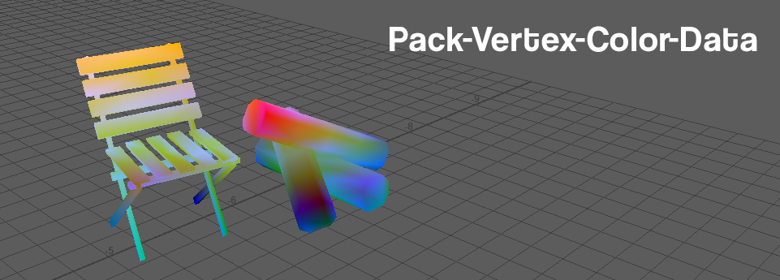
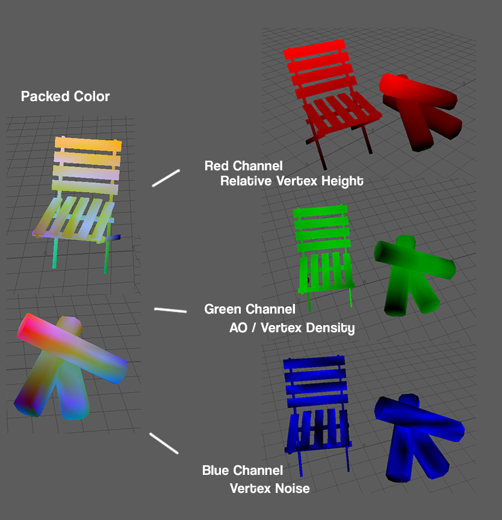
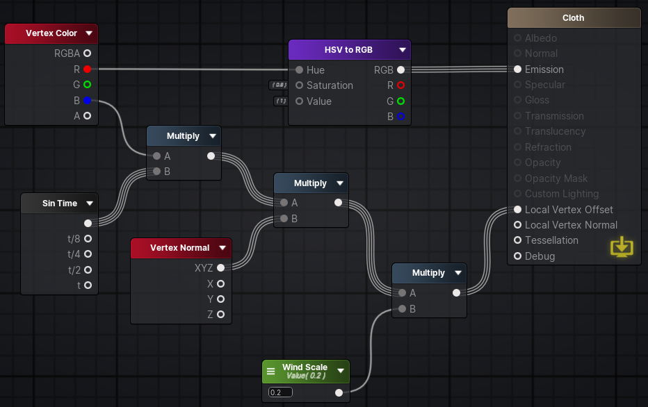
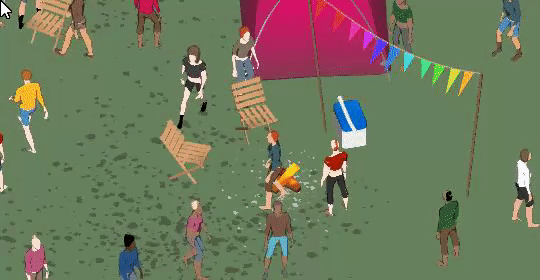

## One-click Maya solution to add useful vertex color data to your meshes

I love vertex colors! They're a super cheap and useful way to pack all sorts of data in your meshes without having to resort to lookup or reference textures. For more stylized projects, it can also just be a way to get some nicely interpolated colors.

After constantly spending too much time painting a bunch of color masks for various projects of mine, I decided enough was enough! With this one-click Maya script, you can now automatically calculate and pack a bunch of helpful data inside of your mesh.

- In the red channel you get relative height data, where 0 is the bottom of your mesh and 1 the top - useful for dissolve effects or color lerps, whatever.
- In the green channel you get a simple vertex density / AO map - this is useful if you want simple baked AO or something like a mask for logs in a campfire.
- In the blue channel you just get random vertex noise - always useful!

This is pretty self explanatory at this point - just pipe these in your friendly neighborhood shader editor and you can then do a bunch of neat stuff like cloth deformation or fire - at practically no cost! If you werent using the vertex colors before they'd just be imported as white anyways.

Anyways, just get the script and pipe it in your Maya shelf, the end.

Oh yeah, I probably wouldn't use this for meshes above 2000 vertices - might be pretty slow when baking the AO.